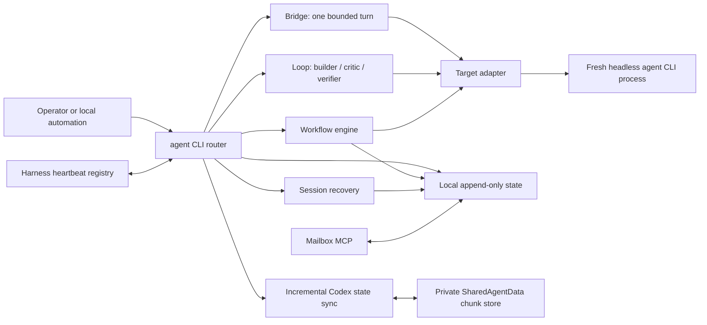

# Architecture

Agent Bridge is a process launcher and local coordination layer. Each bridge or loop phase starts a
fresh headless target process; there is no resident orchestration daemon.



## Components

| Component | Responsibility | Boundary |
| --- | --- | --- |
| `agent_bridge/cli.py` | Prefix routing, command parsing, target invocation | No background daemon |
| `agent_bridge/agents.json` | Declarative target commands and adapter selection | Does not prove installation or authentication |
| `agent_bridge/coord.py` | Task, trace, policy, and transport records | Local state is not a remote authorization service |
| `agent_bridge/mailbox_mcp.py` | Dependency-free JSON-RPC tools for messages, findings, traces, and verdicts | Same-user local coordination, not a multi-tenant trust boundary |
| `agent_bridge/workflow.py` | Portable multi-phase workflow execution and stored results | Invoked engines retain their own provider boundary |
| `agent_bridge/session_recovery.py` | Bounded inventory and redacted continuation handoffs | Does not import raw native chat history |
| `agent_bridge/readiness.py` | Typed client and source readiness evidence | Evidence is scoped to a client, surface, machine, project, and time |
| `agent_bridge/state_sync.py` | Append-aware Codex session objects plus additive project/sidebar merge | Private OneDrive transport; no automatic deletion or live-Desktop import |

## Dispatch path

1. Resolve the current Git root or explicit `--project-dir`.
2. Load the requested target from `agents.json`.
3. Record correlation and task context.
4. Build a mode-specific contract and target command.
5. Apply the target adapter's sandbox and permission flags.
6. Start one fresh process and capture its bounded result.
7. Append trace, finding, verdict, or workflow evidence under the local state directory.

`review` and `code` are separate authority modes. Review is constructed as analysis-only; code may
write inside the selected worktree. Neither mode grants production access, credential use, deploy,
teardown, or direct GitHub publication.

## State and portability

The default state root is:

```text
~/.local/state/agent-bridge/
```

It contains task and event JSONL, findings, verdicts, mailbox messages, workflow artifacts,
transcripts, media conversions, and session-recovery bundles. Set `AGENT_BRIDGE_STATE_DIR` to move
this state to another local directory.

Codex state sync is an explicit private-history surface outside that default
runtime root. It stores immutable compressed chunks and per-machine metadata in
the configured OneDrive `SharedAgentData/AgentBridgeStateSync/v1` tree. An
hourly LaunchAgent or Task Scheduler job calls the same one-shot CLI; it is not
a daemon. Publication may run against live append-only transcripts, but native
index import is deferred until Codex Desktop is closed.

Cross-machine harness registration is a OneDrive-friendly heartbeat store. A fresh record means a
harness recently wrote to the shared folder; it does not prove that a UI session is idle, connected,
or ready for work. Registry filenames use a short hash of the platform's stable machine identifier
instead of the network-dependent hostname; the raw identifier is not stored. Status inspection
prunes heartbeat rows older than 30 days unless `--no-prune` is requested.

## Extension points

Add ordinary CLI targets through the declarative `argv` adapter where possible. Add bespoke adapter
code only when a target requires command construction that the template cannot express.

Portable workflows live under `agent_bridge/workflows/`. Runtime state and private results stay
outside the repository.
