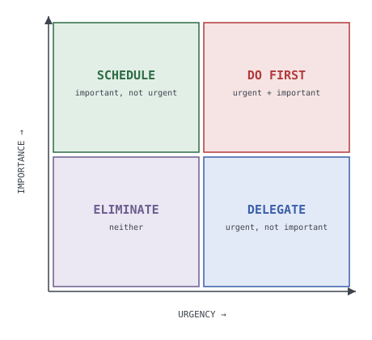
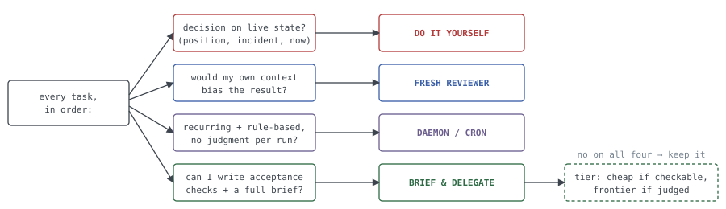

# The Delegation Box

*An Eisenhower-style doctrine for single-threaded agent operations on a budget — one operator, one frontier main thread, occasional sub-agents, a peer session on a second machine, and cron. No agent control plane, no orchestration MCP layer. Derived 2026-08-26 from a live trading day where all four quadrants happened, measured.*

## The premise: your scarcest resource isn't tokens

In a single-threaded setup, the main agent's **attention** and its **accumulated context** are the constrained resources; tokens are merely the currency they're priced in. Every delegation decision is really a decision about *where context should live*: keep the task where the context already is, ship enough context outward to make the task portable, deliberately withhold context because it would bias the work, or freeze the context into code so it costs nothing forever.

Eisenhower's box sorted tasks by *urgency* and *importance*. The second axis is wrong for agent work — almost everything that reaches the main thread is already important. The axis that actually decides routing is **context-coupling**: how much of the task's quality depends on state only the main thread holds right now.

| Classic box | Agent translation |
|---|---|
|  |  |

## The four quadrants

**Q1 — DO IT YOURSELF** (urgent x context-coupled). Live calls, incident triage, anything depending on session-accumulated state. The cold-start cost of a briefing exceeds the task; handoff latency is the failure. Corollary: *simple + urgent + strong situational reasoning: always yourself.* Research agrees from the cost side: orchestration added ~60% markup for no benefit on small problems (Arize).

**Q2 — BRIEF & DELEGATE** (specifiable x latency-tolerant). Work you can fully specify with acceptance checks. The main thread writes the brief — **the brief is the plan** — and a cheaper model executes while the main thread does Q1 work. Measured specimen: a display fix ran 130k tokens on a cheap tier vs an estimated 60-90k frontier tokens inline — roughly 3-4x cheaper in real cost, with the main thread free the whole time. Published numbers rhyme: 96% of quality at 46% of cost on large tasks; a loss on small ones.

**Q3 — FRESH EYES** (your context is the *liability*). Adversarial review, claim audits, "is this actually done?" A builder demonstrably cannot see its own gaps. The delegation target is not a cheaper model but an **uncontaminated** one — isolation is the product. Do not tier this down blindly: judging is the capability with a floor. Spend here.

**Q4 — CODE OR KILL** (recurring x mechanical x judgment-free). The cheapest agent is a cron job. Freeze recurring rule-based work into deterministic code at zero tokens (a 10-minute market tick became a daemon; the model now only synthesizes occasionally and authors the config the code consumes). And some things deserve the classic fourth quadrant verbatim: delete them.

## The decision flow

Route in order; the first yes wins: (1) decision on live state? do it yourself. (2) would my own context bias the result? fresh reviewer. (3) recurring + rule-based, no per-run judgment? daemon/cron. (4) can I write acceptance checks and a full brief? brief-and-delegate, tiered cheap-if-checkable / frontier-if-judged. No on all four: keep it inline. Delegation is the exception that must earn its overhead.

## Five channels on a budget

| Channel | Costs | Buys |
|---|---|---|
| Inline (main thread) | Frontier tokens on a warm cache; attention | Zero cold-start; full situational memory |
| Sub-agent, tiered down | ~1.5-2x the token count at ~1/5 the price | Throughput: main thread freed during execution |
| Fresh-context reviewer | Frontier-adjacent, 80-140k/pass | Independence — the one thing inline can never produce |
| Peer session (2nd machine) | Its own rate-limit pool, not yours | True parallelism + budget isolation; needs contracts |
| Deterministic code | One-time build; then zero forever | Cadence without tokens; survives session death |

**Budget mechanics nobody tells you:** sub-agents spend from *your* session rate limit (one died mid-flight at a 5-hour cap and produced nothing); peer sessions draw from their own pools. Near a limit window the routing changes: peer, then code, then wait, then sub-agent. The enterprise control plane is replaced by four free primitives: **issues as control plane** (claims, fences, acceptance criteria), **a chat channel as bus**, **cron as scheduler**, **files as shared state**.

## Doctrine

1. **The brief is the plan.** Structure it like a contract: task, expected outcome, required tools, must-do, must-not-do, context — plus acceptance checks the delegate must run and report.
2. **Encode the traps in the brief.** Every environment quirk you've paid for goes in verbatim. Briefs are how a single-threaded operation amortizes its scar tissue.
3. **Verification never delegates.** The delegate reports evidence; the delegator re-runs it. Trust the work, never the report.
4. **Tier by verifiability, not difficulty.** Cheaply checkable output: cheapest capable model. Judgment-checked output: the check IS the expensive part; keep it at the frontier. Never cheap out on the judge.
5. **Small tasks stay home.** Below roughly a half-hour of specifiable work, brief + cold-start + verification overhead exceeds the savings. Urgent-and-small is doubly inline.
6. **Fresh context is a feature you cannot fake inline.** Where authorship is the bias, isolation is the deliverable.
7. **The cheapest agent is a cron job.** Gathering is code; judgment is model.
8. **One writer per file.** Parallel channels need conflict fences, not consensus: public claims, named file ownership, sequenced overlaps, declared runtime state.
9. **Escalate on divergence, not on schedule.** Self-correcting delegates need no interruption; dead ones need a scheduled retry. Monitor by completion notification and evidence, never by polling.
10. **High stakes override the whole box.** Custody, execution, credentials, irreversible actions: never delegated for economy — full review loop regardless of cost, or the operator personally. Quadrants optimize spend; they do not relax safety gates.

## Relation to named approaches

- **Orchestrator-workers** (Azure patterns, Anthropic blueprint): we take the Q2 shape — frontier plans, cheap tier executes, planner judges. We skip standing worker fleets.
- **Sequential pipeline:** build, review, fix, re-review with human-visible gates (PRs); no automated chains without evidence checkpoints.
- **Loopcraft / loop engineering** (design the loop, not the prompt; write the methodology, not the instructions): the Delegation Box decides *who* works, loopcraft decides *how they stop*. They compose — a Q3 review is a loop whose stop condition is "a pass that falsifies nothing"; a Q4 daemon is a loop whose stop condition is a kill command; a Q2 delegation is a single loop iteration whose exit test is the acceptance checks. Every loop keeps a terminal condition and a kill command; no unbounded autonomy.
- **Plan-then-execute (architect/editor):** native to the budget; identical to Q2's mechanism.
- **Enterprise control plane:** we take the functions via free primitives; the infrastructure itself is, at this scale, overhead wearing a platform costume.

## Failure modes

**Quadrant drift** (Q2 quietly becoming Q1 because briefing felt slow — watch for shrinking briefs). **Reviewer capture** (reused reviewer context turns Q3 back into Q1; every pass gets a cold start). **Daemon rot** (Q4 code embeds today's thresholds forever; schedule re-derivation). **Shared-limit surprise** (a delegation dying at a rate cap is a scheduling failure, not a delegate failure — check the window before launching).

## Sources

Arize (how cheap models changed multi-agent economics) · claudefa.st (multi-agent orchestration cost math) · MindStudio (smart orchestrator, cheaper sub-agents) · Microsoft Azure Architecture Center (AI agent orchestration patterns) · Fountain City (Anthropic's multi-agent blueprint in production) · agkit (six-section delegation prompts) · Luhui / LangChain / IBM (loopcraft and loop engineering) · Fastio (AI agent delegation patterns). Empirical figures from the 2026-08-25/26 Starrfish Operator sessions.
